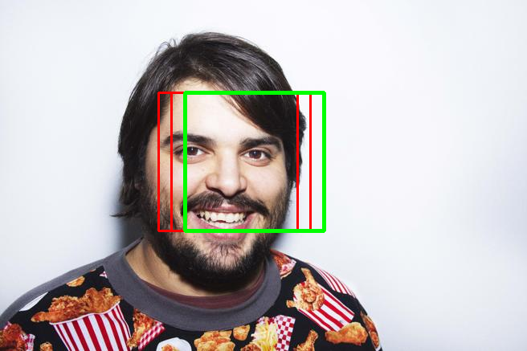

# BIOM-Labs
Lab practices for Biometry Subject, MIARFID.
This repository contains the necessary Python scripts to create and train a NN Face Detector and the necessary Python scripts to use it in a Face Detection pipeline.

## Usage & Scripts

* [model.py](model.py) is the Python script that creates and trains the NN model that, later on will be used in the Face Detection pipeline. To train the model, images containing faces and also images in which no faces appear must be collected and appended to a numpy array. The model is prepared to accept images of 21x21px as input. The creation and training processes use Keras as frontend and Tensorflow as backend.
* [model_faces_20_iter6_dev_DA.hdf5](model_faces_20_iter6_dev_DA.hdf5) is an already trained model.
* [download.py](download.py) is the Python script that makes web scrapping to search and download images given a keyword. Baidu and Google Images will be used as search engines.
* [reconocedor.py](reconocedor.py) is the Python script that executes the Face Detection pipeline. It accepts the following parameters:
⋅⋅* `--img IMG` where IMG is the route to the image to be analized. REQUIRED if `--folder`is not specified.
⋅⋅* `--folder FOLDER`were FOLDER is the route of a folder containing several images to be analized, one after another. REQUIRED if `--img`is not specified.
⋅⋅* `--thr THR` where THR is a float between 0 and 1 indicating the minimum probability for class "face" for an image to be considered face. The higher, the more restrictive. Default 0.999.

## Execution example

```
$ python reconocedor.py --img brays-efe.jpg
```

This command line takes as input the following image:


And outputs the following image:

